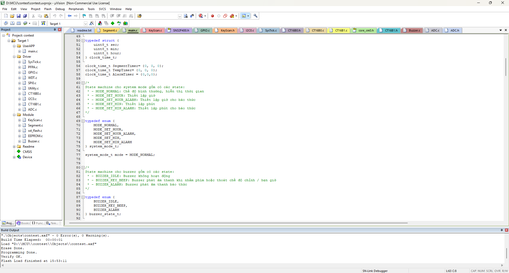

## Digital Clock Project - SN32F407 EVK

Dự án này thực hiện việc xây dựng một thiết bị đồng hồ số (Digital Clock) trên kit phát triển SN32F407 EVK thuộc dòng vi điều khiển của Sonix. Hệ thống cho phép hiển thị thời gian thực, điều chỉnh giờ/phút và cài đặt báo thức lưu trữ trong bộ nhớ EEPROM.

- Tính Năng Chính

    + Hiển thị thời gian thực: Sử dụng 4 LED 7 đoạn hiển thị theo định dạng HH.MM.

    + Điều chỉnh thời gian: Chế độ Setup cho phép thay đổi Giờ và Phút với hiệu ứng nhấp nháy 1s (0.5s ON/0.5s OFF).

    + Hẹn giờ (Alarm): * Cài đặt giờ báo thức và lưu trực tiếp vào EEPROM để không bị mất khi tắt thiết bị.

    + LED chỉ báo (D6) nhấp nháy khi ở chế độ hẹn giờ.

    + Cảnh báo âm thanh: * Còi Buzzer phát tiếng "pip" (0.3s) khi nhấn nút.

    + Phát cảnh báo liên tục trong 5s khi đến giờ hẹn.

    + Chế độ Timeout: Tự động thoát về màn hình chính sau 30 giây nếu không có tương tác nút bấm

Setup cho project Keil UVision:
- Các module và driver được include được thể hiện như trong ảnh

