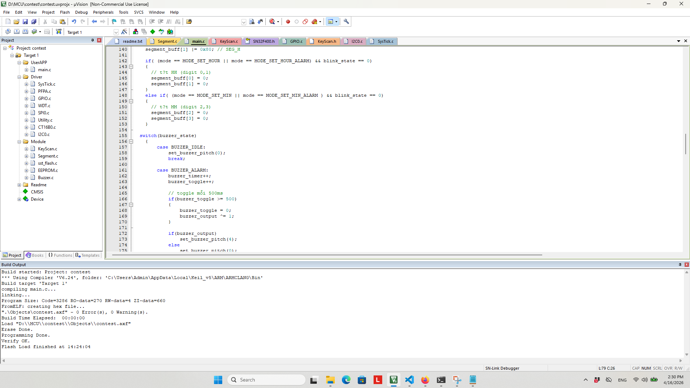

## CODE MCU SONIX 32 BITS

Hiện tại em đã test được các chức năng:
- Điều chỉnh giờ (mode hẹn giờ và điểu chỉnh giờ bình thường)
- Nhấp nháy khi bấm nút

Các task tương ứng trong bài tập: task 1 đến 6.

Bug hiện tại: Hiện em chưa làm được buzzer để phát âm thanh nên em chưa kiểm tra được chức năng Alarm.  Logic cho bật còi thì có vẻ đúng nên em vẫn đang tìm hiểu. Khi debug được bước này có thể chuyển đến các task còn lại và sau đó tối ưu

Setup cho project Keil UVision:
- Ban đầu em tạo copy của ví dụ số 11, tuy nhiên module clock CT16B0 được thay bằng ví dụ 6 vì module này ở ví dụ 11 có vẻ là PWM timer, bỏ module CT16B1 bằng KeilU (không phải xóa files). Structure project giống như trong ảnh:

